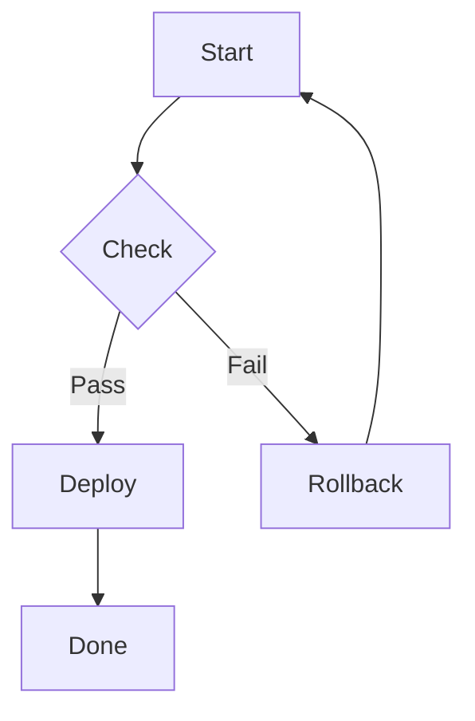
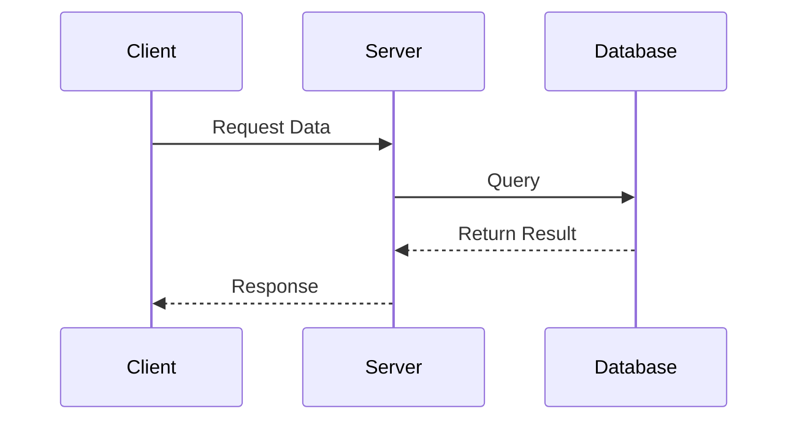
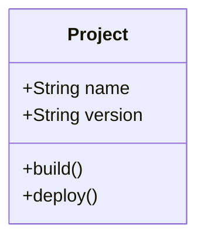
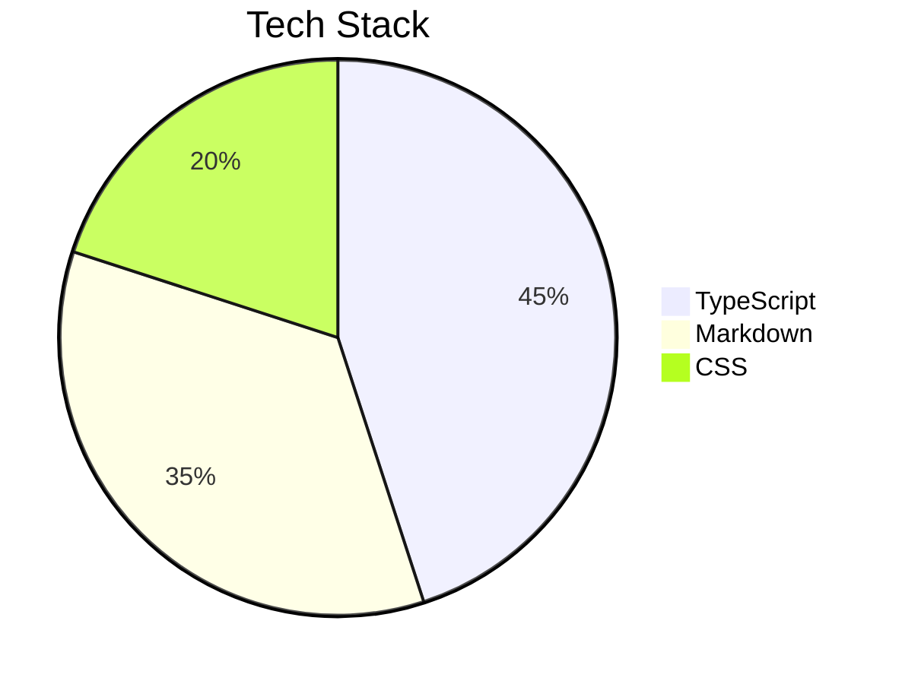

# Mermaid Example

## Flowchart

```mermaid
graph TD
  A[Start] --> B{Check}
  B -->|Pass| C[Deploy]
  B -->|Fail| D[Rollback]
  C --> E[Done]
  D --> A
```

## Sequence Diagram

```mermaid
sequenceDiagram
  participant C as Client
  participant S as Server
  participant D as Database
  C->>S: Request Data
  S->>D: Query
  D-->>S: Return Result
  S-->>C: Response
```

## Class Diagram

```mermaid
classDiagram
  class Project {
    +String name
    +String version
    +build()
    +deploy()
  }
```

## Pie Chart

```mermaid
pie title Tech Stack
  "TypeScript" : 45
  "Markdown" : 35
  "CSS" : 20
```
