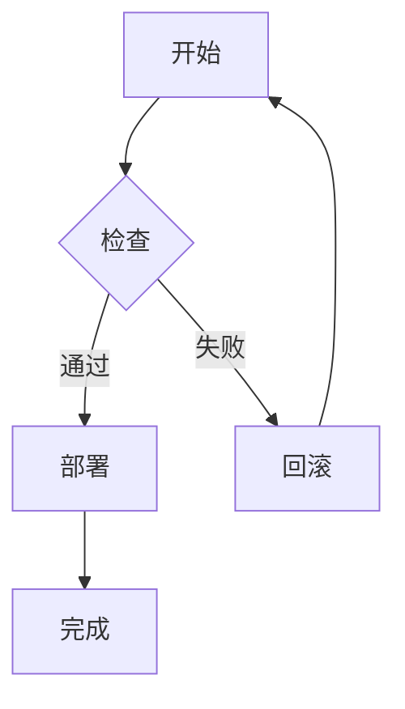
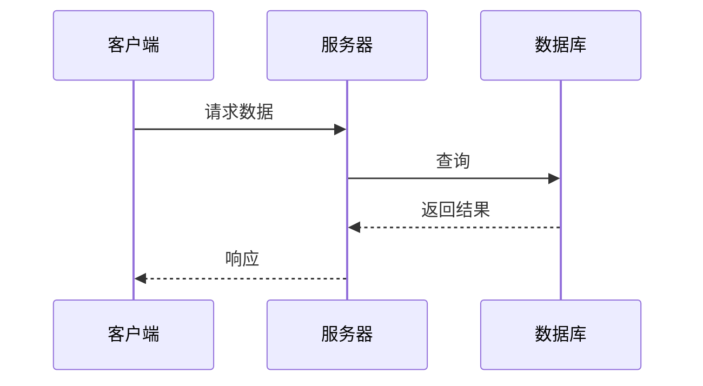
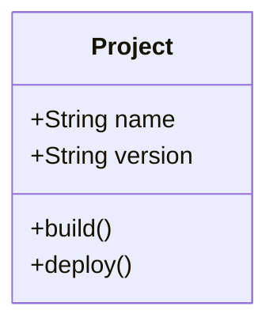
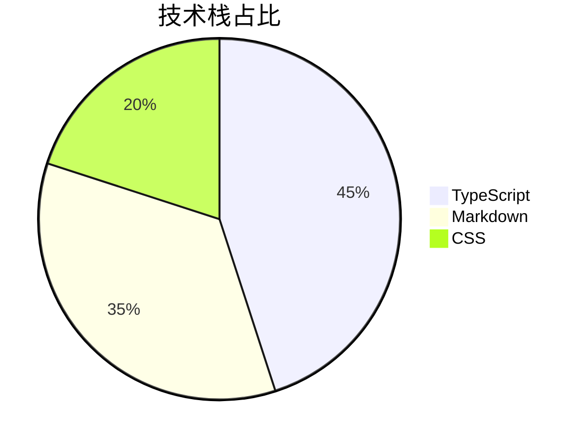

# Mermaid 示例

## 流程图

```mermaid
graph TD
  A[开始] --> B{检查}
  B -->|通过| C[部署]
  B -->|失败| D[回滚]
  C --> E[完成]
  D --> A
```

## 时序图

```mermaid
sequenceDiagram
  participant C as 客户端
  participant S as 服务器
  participant D as 数据库
  C->>S: 请求数据
  S->>D: 查询
  D-->>S: 返回结果
  S-->>C: 响应
```

## 类图

```mermaid
classDiagram
  class Project {
    +String name
    +String version
    +build()
    +deploy()
  }
```

## 饼图

```mermaid
pie title 技术栈占比
  "TypeScript" : 45
  "Markdown" : 35
  "CSS" : 20
```
